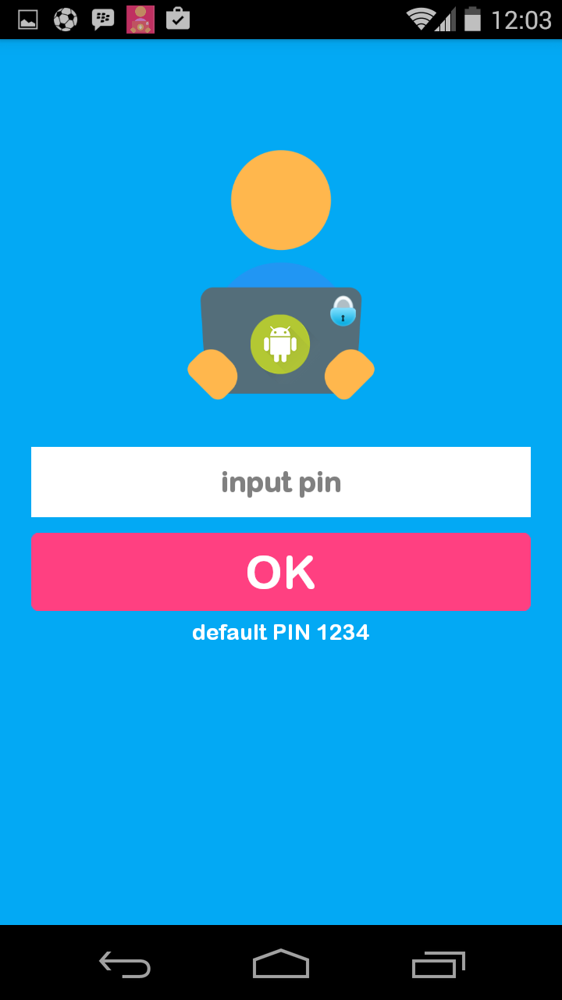
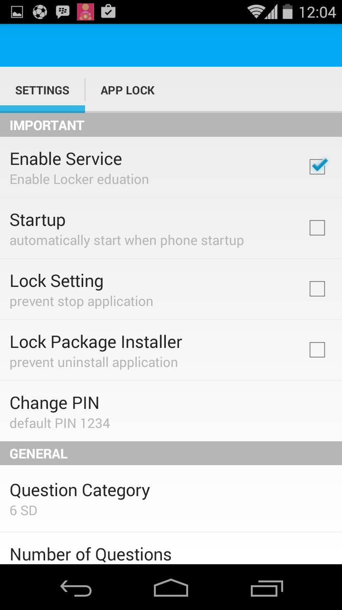
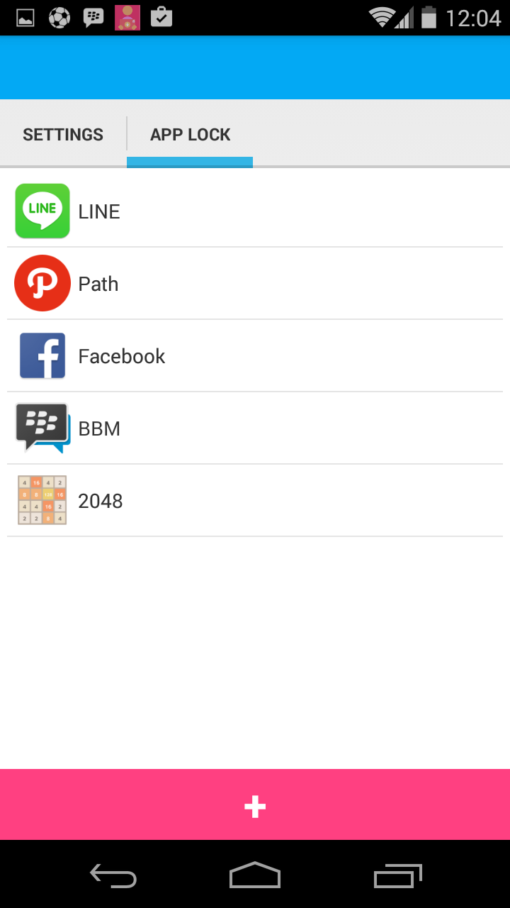
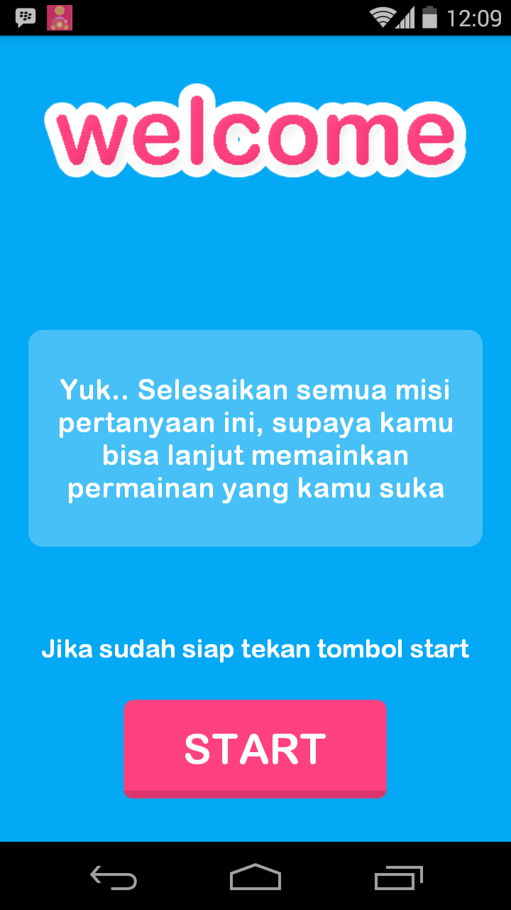
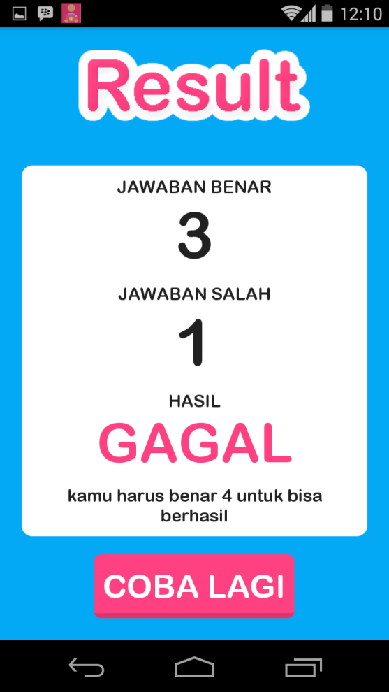
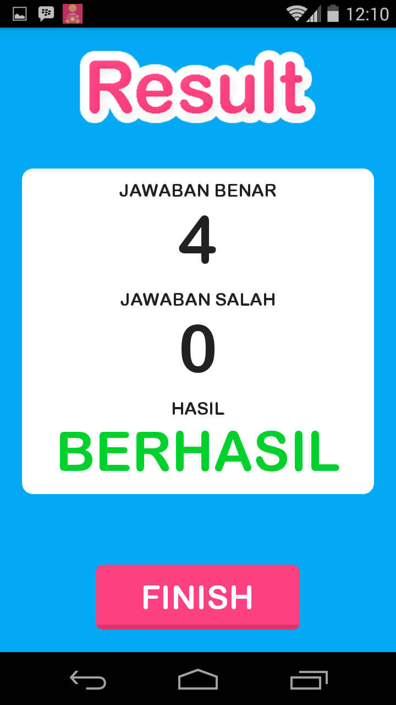

# Android Kunci Edukasi
Android App Lock and Parental Controll apps
 
Aplikasi dibuat pada tahun 2015 yang dijadikan sebagai tugas akhir perkuliahan S1.

Kunci edukasi merupakan aplikasi yang “memaksa” anak untuk belajar sebelum membuka aplikasi / game yang hendak dibuka atau dimainkan. Kenapa disebut memaksa, karena aplikasi ini dibuat  untuk selalu tampil setiap kali anak membuka aplikasi / game dan akan menampilkan soal-soal pelajaran yang disesuaikan dengan tingkat pendidikan si anak (TK,SD,SMP bahkan SMA), Konsepnya mirip seperti app lock yaitu memilih aplikasi yang ingin dikunci agar anak / orang lain tidak dapat membuka aplikasi yang dilock biasanya tampil password atau pattern untuk membukanya, kunci edukasi ini akan mengunci aplikasi yang dilock dengan soal-soal pilihan ganda agar anak menjawab semua soal tersebut dan jika berhasil menjawab pertanyaan tersebut baru dia bisa masuk kehalaman aplikasi/ game yang dibukanya

## Fitur dan Cara penggunaan
### Halaman Login
</img>
 
Halaman tampil pertama kali dibuka atau ketika icon aplikasi kunci edukasi dipilih, default pin adalah `1234` dan bisa diubah dihalaman setting.

### Halaman Setting
</img>
 
Halaman ini merupakan halaman untuk orang tua melakukan konfigurasi, dihalaman ini terdapat 9 menu setting yang bisa diatur oleh orang tua.
   
##### 1. Enable Service 
Untuk start/stop service aplikasi kunci edukasi

##### 2. Startup
Merupakan option untuk mengaktifkan service ketika startup / ketika handphone baru menyala

##### 3. Lock Setting
Untuk mengunci halaman setting, ini berfungsi untuk jaga-jaga agar anak tidak dapat menstop service atau force stop aplikasi kunci edukasi

##### 4. Lock Package Installer
Untuk mengunci unistaller / agar anak tidak dapat menguninstal aplikasi kunci edukasi ini

##### 5. Change PIN
Untuk merubah pin yang digunakan ketika login

##### 6. Question Category
Untuk memilih kategori yang ingin ditampilkan disesuikan sesuai pendidikan si anak

##### 7. Number of Question
Untuk menentukan jumlah pertanyaan yang tampil pada kunci edukasi

##### 8. Number of Goals
Untuk menentukan goal yang harus dicapai agar anak bisa lanjut atau berhasil

##### 9. Download Question
Merupakan feature untuk download pertanyaan agar aplikas bisa digunakan ketika offline, karena secara default soal yang ditampilkan merupakan dari web service dan harus ada koneksi internet

### Halaman Tambah App Lock
</img>
 
Halaman Tambah app lock adalah halaman yang menampilkan daftar aplikasi yg terinstal di smartphone android.  pilih cek lalu klik tambah. untuk menambah aplikasi ke daftar app lock   
### Halaman Utama
</img>
 
Halaman utama adalah halaman utama untuk anak, ketika anak membuka aplikasi yang terdaftar diapp lock. Maka secara otomatis halaman ini tampil dihalaman dan juga sistem mempersiapkan pertanyaan akan ditampilkan dihalaman berikutnya.
### Halaman Pertanyaan
</img>
 
Halaman pertanyaan adalah halaman inti dari aplikasi ini dimana disini akan tampil pertaanyaan - pertanyaan sesuai kelas atau kategori yang ditentukan oleh orang  tua dah harus dijawab dengan benar agar bisa lanjut.

### Halaman Hasil Gagal
</img>
 
Halaman hasil gagal adalah halaman yang menampilkan hasil jika gagal menjawab semua pertanyaan dan muncul tombol coba lagi.

### Halaman Berhasil
</img>
 
Halaman hasil adalah halaman hasil dan ketika anak berhasil menjawab pertanyaan dengan benar sesuai jumlah yang diinginkan orang tua. maka dia bisa lanjut keaplikasi yang dia inginkan dengan menekan tombol lanjut.

### libs
* [android-async-http](https://loopj.com/android-async-http/)
